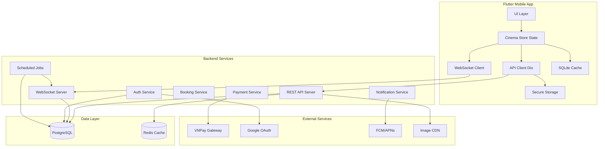

# Design Document: Cinema Booking API Integration

## Overview

The Cinema Booking API Integration transforms the existing Flutter prototype into a production-ready cinema booking platform by implementing comprehensive backend connectivity, real-time synchronization, payment processing, and administrative capabilities. The system follows a client-server architecture where the Flutter mobile application communicates with a RESTful backend API supplemented by WebSocket connections for real-time features.

### Core Design Principles

1. **Separation of Concerns**: Clear boundaries between API client, business logic, state management, and UI layers
2. **Real-time First**: WebSocket-based seat synchronization with polling fallback for resilience
3. **Security by Default**: JWT authentication, HMAC validation for payments, encrypted storage for tokens
4. **Graceful Degradation**: Offline support with local caching for essential features (ticket viewing)
5. **Race Condition Safety**: Database-level locking and optimistic concurrency control for seat bookings
6. **Audit Trail**: Comprehensive logging of all authentication, booking, and payment operations

### Key Technical Decisions

- **HTTP Client**: Dio library for interceptor support (authentication, logging, error handling)
- **State Management**: Existing Cinema_Store with reactive updates from WebSocket events
- **WebSocket Protocol**: JSON messages over WSS with automatic reconnection and ping/pong keepalive
- **Authentication Flow**: OAuth 2.0 for Google, JWT with refresh token rotation for session management
- **Payment Integration**: VNPay redirect flow with HMAC-SHA512 signature verification
- **Local Storage**: Flutter Secure Storage for tokens, sqflite for offline booking cache
- **Concurrency Strategy**: Pessimistic locking (SELECT FOR UPDATE) for critical seat reservation operations

## Architecture

### System Architecture Diagram



### Component Interaction Flow

**Authentication Flow**:
1. User initiates Google OAuth → API Client redirects to Google
2. Google returns authorization code → API Client exchanges for tokens
3. Backend validates with Google → Issues JWT + Refresh Token
4. API Client stores tokens in Secure Storage → Attaches JWT to all requests

**Seat Booking Flow**:
1. User opens seat selection → WebSocket connects for real-time updates
2. User selects seats → API Client posts hold request with pessimistic locking
3. Backend acquires row locks → Creates 10-minute hold → Broadcasts status
4. User completes booking → API Client posts booking with holdId
5. Backend validates hold → Initiates VNPay payment → Returns payment URL
6. User completes payment → VNPay callback → Backend validates signature
7. Payment success → Backend updates booking → Sends push notification → Generates QR code

**Real-time Synchronization Flow**:
1. WebSocket establishes connection with JWT authentication
2. Any seat status change triggers broadcast to all connected clients
3. Clients update local state immediately for responsive UI
4. Hold expiration job releases seats → Broadcasts availability
5. Connection drop triggers exponential backoff reconnection → Full state sync

### Security Architecture

**Authentication Layers**:
- **Layer 1**: TLS 1.3 encryption for all network communication
- **Layer 2**: JWT authentication with 15-minute access token expiration
- **Layer 3**: Refresh token rotation (7-day expiration) with secure storage
- **Layer 4**: Role-based access control (customer, staff, admin) with permission flags

**Payment Security**:
- **HMAC-SHA512** signature validation for all VNPay callbacks
- **No card storage**: Redirect to VNPay payment page, receive tokenized transaction ID
- **Transaction logging**: Full audit trail with request/response for dispute resolution
- **Timeout enforcement**: 15-minute payment window with automatic cancellation

**Data Protection**:
- **Secure Storage**: Platform-specific keychains for JWT tokens (iOS Keychain, Android Keystore)
- **Password Hashing**: bcrypt with cost factor 12 on backend
- **Input Validation**: Schema validation for all API requests and responses
- **Rate Limiting**: 100 req/min unauthenticated, 500 req/min authenticated per user

## Components and Interfaces

### 1. API Client Module (APIClient)

**Responsibility**: Manages all HTTP communication with backend API including authentication, error handling, and request/response serialization.

**Interface**:
```dart
class APIClient {
  // Authentication
  Future<AuthResponse> loginWithGoogle(String authCode);
  Future<AuthResponse> loginWithEmail(String email, String password);
  Future<AuthResponse> register(RegisterRequest request);
  Future<void> logout();
  Future<AuthResponse> refreshToken(String refreshToken);
  
  // Movies
  Future<PaginatedResponse<Movie>> getMovies({String? search, String? genre, String? status, int page = 1});
  Future<Movie> getMovieDetails(String movieId);
  Future<List<Review>> getMovieReviews(String movieId, {int page = 1});
  
  // Showtimes and Seats
  Future<List<Showtime>> getShowtimes(String movieId, {DateTime? date});
  Future<SeatMap> getSeats(String showtimeId);
  Future<HoldResponse> holdSeats(String showtimeId, List<String> seatCodes);
  
  // Bookings
  Future<BookingResponse> createBooking(CreateBookingRequest request);
  Future<Booking> getBookingDetails(String bookingId);
  Future<List<Booking>> getUserBookings({String? status});
  Future<String> getBookingQRCode(String bookingId);
  Future<CancelResponse> cancelBooking(String bookingId);
  
  // Food Combos
  Future<List<FoodCombo>> getFoodCombos();
  
  // Reviews
  Future<Review> createReview(CreateReviewRequest request);
  
  // User Profile
  Future<UserProfile> getProfile();
  Future<UserProfile> updateProfile(UpdateProfileRequest request);
  Future<NotificationPreferences> getNotificationPreferences();
  Future<void> updateNotificationPreferences(NotificationPreferences prefs);
  
  // Device Registration
  Future<void> registerDevice(String deviceToken, String platform);
  Future<void> unregisterDevice(String deviceToken);
  
  // Staff Operations
  Future<ValidationResult> validateTicket(String bookingId, String expectedShowtimeId);
  Future<List<Booking>> searchBookings({String? bookingId, String? customerName});
  Future<void> reportRoomIssue(String roomId, String reason, String description);
  Future<void> setRoomReady(String roomId, String resolutionNotes);
  Future<void> modifyBookingSeats(String bookingId, List<String> newSeatCodes);
  Future<void> modifyBookingCombos(String bookingId, List<ComboSelection> combos);
  
  // Admin Operations (simplified - full admin API would be extensive)
  Future<DashboardMetrics> getDashboardMetrics();
  Future<RevenueReport> getRevenueReport(DateTime startDate, DateTime endDate);
}
```

**Key Behaviors**:
- **Automatic Token Attachment**: Interceptor attaches JWT to Authorization header as "Bearer {token}"
- **Automatic Token Refresh**: On 401 response, attempts refresh using Refresh_Token and retries original request
- **Error Mapping**: Maps HTTP status codes to typed exceptions (ApiValidationException, ApiAuthException, etc.)
- **Timeout Handling**: 30s for standard requests, 60s for payment operations
- **Retry Logic**: Exponential backoff for network failures (up to 3 attempts)
- **Request Logging**: Logs all requests with method, path, duration, status for debugging

**Dependencies**:
- Dio (HTTP client)
- SecureStorageService (token persistence)
- JsonSerializable (model serialization)

### 2. WebSocket Client Module (WebSocketClient)

**Responsibility**: Maintains real-time connection for seat status synchronization with automatic reconnection and state management.

**Interface**:
```dart
class WebSocketClient {
  // Connection Management
  Future<void> connect(String showtimeId, String jwtToken);
  Future<void> disconnect();
  void dispose();
  
  // State Streams
  Stream<ConnectionState> get connectionStateStream;
  Stream<SeatUpdate> get seatUpdateStream;
  
  // Connection State
  ConnectionState get currentState; // connecting, connected, disconnected, error
}

class SeatUpdate {
  final String seatCode;
  final SeatStatus status; // available, held, booked, selected
  final String? userId;
  final DateTime? expiresAt; // for held seats
}
```

**Key Behaviors**:
- **Connection URL**: `wss://api.example.com/ws/showtimes/{showtimeId}/seats?token={jwt}`
- **Keepalive**: Sends ping frames every 30 seconds, expects pong within 5 seconds
- **Reconnection Strategy**: Exponential backoff starting at 1s: 1s → 2s → 4s → 8s → max 30s
- **State Sync**: On reconnection, fetches full seat state from REST API before resuming updates
- **Lifecycle Management**: Disconnects on app background, reconnects on foreground resume
- **Message Format**: JSON with `{type: 'seat_update', data: {seatCode, status, userId, expiresAt}}`

**Dependencies**:
- web_socket_channel package
- APIClient (for state sync after reconnection)
- Cinema_Store (for state updates)

### 3. Authentication Service (AuthService)

**Responsibility**: Manages authentication flows, token lifecycle, and secure credential storage.

**Interface**:
```dart
class AuthService {
  // Authentication
  Future<AuthResult> signInWithGoogle();
  Future<AuthResult> signInWithEmail(String email, String password);
  Future<AuthResult> register(String email, String password, String fullName, String phone);
  Future<void> signOut();
  
  // Token Management
  Future<String> getAccessToken();
  Future<bool> isAuthenticated();
  Future<void> refreshAccessToken();
  
  // User Session
  Stream<AuthState> get authStateStream;
  UserProfile? get currentUser;
}

enum AuthState { unauthenticated, authenticated, refreshing, error }
```

**Key Behaviors**:
- **Google OAuth Flow**: Uses google_sign_in package, exchanges auth code via backend API
- **Token Storage**: Stores JWT and Refresh Token in Flutter Secure Storage (platform keychains)
- **Automatic Refresh**: Monitors token expiration, proactively refreshes before expiry
- **Session Cleanup**: On logout, revokes tokens on backend and clears all local storage
- **Auth State Management**: Broadcasts state changes via stream for UI reactivity

**Dependencies**:
- google_sign_in package
- SecureStorageService
- APIClient

### 4. Payment Service (PaymentService)

**Responsibility**: Handles payment flow integration with VNPay gateway including webview management and result polling.

**Interface**:
```dart
class PaymentService {
  // Payment Flow
  Future<PaymentResult> processPayment(String bookingId, String paymentUrl);
  Future<PaymentStatus> pollPaymentStatus(String bookingId);
  
  // Helpers
  Future<void> openPaymentWebView(String url);
  bool isReturnUrl(String url);
  PaymentResult parseReturnUrl(String url);
}

enum PaymentStatus { pending, processing, success, failed, timeout, cancelled }

class PaymentResult {
  final PaymentStatus status;
  final String? transactionId;
  final String? errorMessage;
  final String bookingId;
}
```

**Key Behaviors**:
- **Webview Integration**: Opens in-app browser with payment URL and navigation controls
- **URL Monitoring**: Detects VNPay return URL to extract payment result parameters
- **Timeout Handling**: Enforces 15-minute payment window, shows timeout UI if exceeded
- **Result Polling**: If webview is force-closed, polls booking status API every 2 seconds for 30 seconds
- **Navigation Lock**: Prevents back navigation during payment to avoid incomplete transactions
- **Success Animation**: Displays success animation and navigates to confirmation screen on success

**Dependencies**:
- webview_flutter or flutter_inappwebview package
- APIClient (for booking status polling)
- Cinema_Store (for booking state updates)

### 5. Push Notification Handler (PushNotificationHandler)

**Responsibility**: Manages push notification registration, reception, and routing to appropriate app screens.

**Interface**:
```dart
class PushNotificationHandler {
  // Initialization
  Future<void> initialize();
  Future<void> requestPermission();
  
  // Device Registration
  Future<void> registerDevice();
  Future<void> unregisterDevice();
  
  // Notification Handling
  Stream<RemoteMessage> get notificationStream;
  void handleNotificationTap(RemoteMessage message);
  
  // Token Management
  Future<String?> getDeviceToken();
}
```

**Key Behaviors**:
- **Platform Detection**: Uses FCM for Android, APNs for iOS via firebase_messaging package
- **Permission Request**: Requests OS notification permission on app launch (authenticated users only)
- **Token Registration**: Posts device token to backend API for push targeting
- **Foreground Handling**: Displays in-app notification banner when app is active
- **Background Handling**: Routes notification tap to appropriate screen based on deeplink
- **Token Refresh**: Monitors token changes (app reinstall) and updates backend registration

**Deeplink Routing**:
- `cinema://booking/{bookingId}` → Booking details screen
- `cinema://movie/{movieId}` → Movie details screen
- `cinema://promotions` → Promotions list screen

**Dependencies**:
- firebase_messaging package
- firebase_core package
- APIClient (for device registration)
- App navigation router

### 6. QR Code Scanner Service (QRScannerService)

**Responsibility**: Handles QR code scanning for staff ticket validation with camera integration.

**Interface**:
```dart
class QRScannerService {
  // Scanning
  Future<void> startScanning(Function(String) onCodeDetected);
  Future<void> stopScanning();
  
  // Validation
  Future<ValidationResult> validateTicket(String qrCodeData, String expectedShowtimeId);
  
  // Parsing
  BookingInfo parseQRCode(String qrCodeData); // Format: CINELUXE|bookingId|userId|showtimeId|seats
}

class ValidationResult {
  final bool isValid;
  final String? errorMessage;
  final BookingInfo? bookingInfo;
  final ValidationDetails? details; // customer name, movie, seats
}
```

**Key Behaviors**:
- **Camera Access**: Uses mobile_scanner or qr_code_scanner package for camera QR detection
- **Format Validation**: Verifies QR code matches expected format: `CINELUXE|{bookingId}|{userId}|{showtimeId}|{seats}`
- **API Validation**: Calls backend validation endpoint with bookingId and expectedShowtimeId
- **Result Display**: Shows success (green) or error (red) UI with validation details
- **Continuous Scanning**: Automatically continues scanning after validation for staff efficiency

**Dependencies**:
- mobile_scanner or qr_code_scanner package
- APIClient (for validation endpoint)
- Camera permissions

### 7. Offline Cache Manager (CacheManager)

**Responsibility**: Manages local caching of bookings and movies for offline access with sync strategy.

**Interface**:
```dart
class CacheManager {
  // Booking Cache
  Future<void> cacheBooking(Booking booking);
  Future<List<Booking>> getCachedBookings();
  Future<Booking?> getCachedBooking(String bookingId);
  Future<void> syncBookings(); // Fetch updates from API
  
  // Movie Cache
  Future<void> cacheMovies(List<Movie> movies);
  Future<List<Movie>> getCachedMovies();
  Future<bool> isCacheStale(); // Check 1-hour TTL
  
  // QR Code Cache
  Future<void> cacheQRCode(String bookingId, Uint8List imageData);
  Future<Uint8List?> getCachedQRCode(String bookingId);
}
```

**Key Behaviors**:
- **Storage**: Uses sqflite for structured caching with tables: cached_bookings, cached_movies
- **TTL Management**: Marks cache entries with timestamp, checks staleness on read
- **Stale-While-Revalidate**: Displays cached data immediately while fetching fresh data in background
- **Offline Indicator**: Adds visual badge to indicate data is from cache (not live)
- **Sync Strategy**: On connectivity restoration, syncs cached bookings with backend to detect changes
- **QR Code Storage**: Caches QR code PNG as blob for offline ticket display

**Dependencies**:
- sqflite package
- path_provider package
- NetworkConnectivity monitor

### 8. Booking State Machine (BookingFlowManager)

**Responsibility**: Orchestrates multi-step booking flow with state persistence and error recovery.

**Interface**:
```dart
class BookingFlowManager {
  // Flow State
  BookingFlowState get currentState;
  Stream<BookingFlowState> get stateStream;
  
  // Flow Steps
  Future<void> startBooking(Showtime showtime);
  Future<void> selectSeats(List<String> seatCodes);
  Future<void> selectCombos(List<ComboSelection> combos);
  Future<void> reviewBooking();
  Future<PaymentResult> submitPayment();
  Future<void> completeBooking(PaymentResult result);
  Future<void> cancelBooking();
  
  // Hold Management
  Future<void> extendHold();
  Duration get remainingHoldTime;
  Stream<Duration> get holdTimerStream;
}

enum BookingFlowState {
  idle,
  selectingSeats,
  seatsSelected,
  selectingCombos,
  reviewing,
  holdingSeats,
  processingPayment,
  completed,
  cancelled,
  error
}
```

**Key Behaviors**:
- **State Persistence**: Saves flow state to local storage for recovery after app restart
- **Hold Timer**: Countdown timer displaying remaining time (10 minutes from hold creation)
- **Automatic Transitions**: Advances state based on successful API responses
- **Error Recovery**: On payment failure, allows retry or returns to seat selection
- **Seat Release**: Automatically releases held seats on booking cancellation or timeout
- **Validation**: Prevents invalid state transitions (e.g., payment without seat selection)

**Dependencies**:
- APIClient
- Cinema_Store
- LocalStorage (for state persistence)

## Data Models

### Core Domain Models

**User**:
```dart
class UserProfile {
  final String id;
  final String email;
  final String fullName;
  final String? phone;
  final DateTime? birthdate;
  final String? avatarUrl;
  final MemberRank memberRank; // silver, gold, platinum
  final int points;
  final UserRole role; // customer, staff, admin
  final List<String> permissions; // for staff: ["Soát vé", "Quản lý phòng", etc]
  final bool isActive;
  final DateTime createdAt;
}
```

**Movie**:
```dart
class Movie {
  final String id;
  final String title;
  final String description;
  final List<String> genres;
  final int durationMinutes;
  final String director;
  final List<String> cast;
  final String posterUrl;
  final String trailerUrl;
  final double rating; // calculated from reviews
  final AgeRating ageRating; // P, C13, C16, C18, T18
  final DateTime releaseDate;
  final MovieStatus status; // nowShowing, comingSoon
}
```

**Showtime**:
```dart
class Showtime {
  final String id;
  final String movieId;
  final String roomId;
  final DateTime startTime;
  final DateTime endTime;
  final int basePrice; // VND
  final ShowtimeStatus status; // scheduled, cancelled
  final String roomName;
  final String cinemaName;
  final String cinemaAddress;
}
```

**Seat and Seat Status**:
```dart
class Seat {
  final String seatCode; // e.g., "A1", "B5"
  final int row;
  final int column;
  final SeatType type; // standard, vip, couple
  final SeatStatus status;
  final String? holdUserId; // if status is held
  final DateTime? holdExpiresAt;
}

enum SeatStatus { available, held, booked, selected }
enum SeatType { standard, vip, couple }
```

**Booking**:
```dart
class Booking {
  final String id;
  final String userId;
  final String showtimeId;
  final List<String> seatCodes;
  final List<ComboSelection> combos;
  final int totalAmount; // VND
  final BookingStatus status; // active, used, cancelled, refunded
  final String? qrCodeUrl;
  final DateTime createdAt;
  final DateTime? validatedAt;
  final String? validatedByStaffId;
  
  // Denormalized for convenience
  final String movieTitle;
  final String posterUrl;
  final DateTime showtimeDateTime;
  final String cinemaName;
  final String roomName;
}

enum BookingStatus { active, used, cancelled, refunded }
```

**Payment**:
```dart
class Payment {
  final String id;
  final String bookingId;
  final int amount;
  final PaymentMethod method; // vnpay, momo, cash
  final PaymentStatus status; // pending, success, failed, refunded
  final String? transactionId; // VNPay transaction ID
  final String? responseCode; // VNPay response code
  final DateTime? paidAt;
  final DateTime createdAt;
}

enum PaymentMethod { vnpay, momo, cash }
```

**FoodCombo**:
```dart
class FoodCombo {
  final String id;
  final String name;
  final String description;
  final int price; // VND
  final String imageUrl;
  final bool isActive;
}

class ComboSelection {
  final String comboId;
  final int quantity;
}
```

**Review**:
```dart
class Review {
  final String id;
  final String userId;
  final String userName;
  final String movieId;
  final int rating; // 1-5
  final String comment;
  final bool isVerified; // true if user has watched movie
  final DateTime createdAt;
}
```

**SeatHold**:
```dart
class SeatHold {
  final String id;
  final String userId;
  final String showtimeId;
  final List<String> seatCodes;
  final DateTime expiresAt; // 10 minutes from creation
  final DateTime createdAt;
}
```

### API Request/Response Models

**AuthResponse**:
```dart
class AuthResponse {
  final String accessToken; // JWT, 15 min expiry
  final String refreshToken; // 7 day expiry
  final UserProfile user;
  final DateTime expiresAt;
}
```

**HoldResponse**:
```dart
class HoldResponse {
  final String holdId;
  final List<String> heldSeats;
  final DateTime expiresAt;
  final int remainingSeconds; // for UI countdown
}
```

**BookingResponse**:
```dart
class BookingResponse {
  final String bookingId;
  final String paymentUrl; // VNPay payment page URL
  final int totalAmount;
  final DateTime expiresAt; // 15 min payment window
}
```

**ValidationResult**:
```dart
class ValidationResult {
  final bool isValid;
  final BookingStatus? bookingStatus;
  final String? errorMessage;
  final ValidationDetails? details;
}

class ValidationDetails {
  final String customerName;
  final String movieTitle;
  final DateTime showtimeDateTime;
  final List<String> seatCodes;
  final String roomName;
}
```

### API Error Models

```dart
class ApiError {
  final String code;
  final String message;
  final DateTime timestamp;
  final String path;
  final Map<String, dynamic>? fieldErrors; // for validation errors
}

// Exception Classes
class ApiValidationException implements Exception {
  final ApiError error;
  ApiValidationException(this.error);
}

class ApiAuthException implements Exception {
  final ApiError error;
  ApiAuthException(this.error);
}

class ApiNotFoundException implements Exception {
  final ApiError error;
  ApiNotFoundException(this.error);
}

class ApiConflictException implements Exception {
  final ApiError error;
  ApiConflictException(this.error);
}

class ApiServerException implements Exception {
  final ApiError error;
  ApiServerException(this.error);
}

class ApiRateLimitException implements Exception {
  final ApiError error;
  final DateTime retryAfter;
  ApiRateLimitException(this.error, this.retryAfter);
}
```

### Database Schema (Backend Reference)

**Users Table**:
```sql
CREATE TABLE users (
  id UUID PRIMARY KEY DEFAULT gen_random_uuid(),
  email VARCHAR(255) UNIQUE NOT NULL,
  password_hash VARCHAR(255), -- NULL for OAuth users
  full_name VARCHAR(255) NOT NULL,
  phone VARCHAR(20),
  birthdate DATE,
  avatar_url TEXT,
  member_rank VARCHAR(20) DEFAULT 'silver', -- silver, gold, platinum
  points INTEGER DEFAULT 0,
  role VARCHAR(20) DEFAULT 'customer', -- customer, staff, admin
  permissions JSONB, -- for staff: ["Soát vé", "Quản lý phòng", etc]
  is_active BOOLEAN DEFAULT true,
  created_at TIMESTAMP DEFAULT NOW(),
  updated_at TIMESTAMP DEFAULT NOW(),
  deleted_at TIMESTAMP -- soft delete
);

CREATE INDEX idx_users_email ON users(email);
CREATE INDEX idx_users_role ON users(role);
```

**Bookings Table**:
```sql
CREATE TABLE bookings (
  id UUID PRIMARY KEY DEFAULT gen_random_uuid(),
  user_id UUID NOT NULL REFERENCES users(id),
  showtime_id UUID NOT NULL REFERENCES showtimes(id),
  seat_codes JSONB NOT NULL, -- ["A1", "A2", etc]
  combos JSONB, -- [{comboId, quantity}, ...]
  total_amount INTEGER NOT NULL,
  status VARCHAR(20) DEFAULT 'active', -- active, used, cancelled, refunded
  qr_code_url TEXT,
  validated_at TIMESTAMP,
  validated_by_staff_id UUID REFERENCES users(id),
  created_at TIMESTAMP DEFAULT NOW(),
  updated_at TIMESTAMP DEFAULT NOW(),
  
  CONSTRAINT fk_user FOREIGN KEY (user_id) REFERENCES users(id),
  CONSTRAINT fk_showtime FOREIGN KEY (showtime_id) REFERENCES showtimes(id)
);

CREATE INDEX idx_bookings_user_id ON bookings(user_id);
CREATE INDEX idx_bookings_showtime_id ON bookings(showtime_id);
CREATE INDEX idx_bookings_status ON bookings(status);
CREATE INDEX idx_bookings_created_at ON bookings(created_at);
```

**ShowtimeSeats Table** (critical for concurrency):
```sql
CREATE TABLE showtime_seats (
  id UUID PRIMARY KEY DEFAULT gen_random_uuid(),
  showtime_id UUID NOT NULL REFERENCES showtimes(id),
  seat_code VARCHAR(10) NOT NULL,
  row_num INTEGER NOT NULL,
  col_num INTEGER NOT NULL,
  seat_type VARCHAR(20) NOT NULL, -- standard, vip, couple
  status VARCHAR(20) DEFAULT 'available', -- available, held, booked
  held_by_user_id UUID REFERENCES users(id),
  hold_expires_at TIMESTAMP,
  booked_by_booking_id UUID REFERENCES bookings(id),
  version INTEGER DEFAULT 0, -- for optimistic locking
  
  UNIQUE(showtime_id, seat_code)
);

CREATE INDEX idx_showtime_seats_showtime ON showtime_seats(showtime_id);
CREATE INDEX idx_showtime_seats_status ON showtime_seats(status);
CREATE INDEX idx_showtime_seats_expires ON showtime_seats(hold_expires_at) WHERE status = 'held';
```

**SeatHolds Table**:
```sql
CREATE TABLE seat_holds (
  id UUID PRIMARY KEY DEFAULT gen_random_uuid(),
  user_id UUID NOT NULL REFERENCES users(id),
  showtime_id UUID NOT NULL REFERENCES showtimes(id),
  seat_codes JSONB NOT NULL,
  expires_at TIMESTAMP NOT NULL, -- 10 minutes from creation
  created_at TIMESTAMP DEFAULT NOW()
);

CREATE INDEX idx_seat_holds_expires ON seat_holds(expires_at);
CREATE INDEX idx_seat_holds_user_showtime ON seat_holds(user_id, showtime_id);
```

**Payments Table**:
```sql
CREATE TABLE payments (
  id UUID PRIMARY KEY DEFAULT gen_random_uuid(),
  booking_id UUID NOT NULL REFERENCES bookings(id),
  amount INTEGER NOT NULL,
  method VARCHAR(20) NOT NULL, -- vnpay, momo, cash
  status VARCHAR(20) DEFAULT 'pending', -- pending, success, failed, refunded
  transaction_id VARCHAR(255), -- VNPay transaction ID
  response_code VARCHAR(10), -- VNPay response code
  request_data JSONB, -- full request payload for audit
  response_data JSONB, -- full response payload for audit
  paid_at TIMESTAMP,
  created_at TIMESTAMP DEFAULT NOW(),
  updated_at TIMESTAMP DEFAULT NOW()
);

CREATE INDEX idx_payments_booking_id ON payments(booking_id);
CREATE INDEX idx_payments_status ON payments(status);
CREATE INDEX idx_payments_transaction_id ON payments(transaction_id);
```


## Error Handling

### Error Classification and Strategy

**Client-Side Errors (4xx)**:
- **400 Bad Request**: Display field-specific validation errors inline with form inputs
- **401 Unauthorized**: Clear session, redirect to login screen
- **403 Forbidden**: Display permission denied message with explanation
- **404 Not Found**: Display "Resource not found" with navigation back to safe screen
- **409 Conflict**: Handle specifically based on context:
  - Seat booking conflict: Refresh seat map, highlight unavailable seats, prompt re-selection
  - Email already exists: Display inline error on registration form
  - Showtime scheduling conflict: Display conflicting showtime details for admin resolution
- **429 Too Many Requests**: Display rate limit message with retry countdown from Retry-After header

**Server-Side Errors (5xx)**:
- **500 Internal Server Error**: Display generic error message, log to analytics, offer retry option
- **503 Service Unavailable**: Display maintenance message, enter offline mode with cached data

**Network Errors**:
- **Connection Timeout**: Display "Connection timeout" with retry button
- **DNS Resolution Failure**: Display "Cannot connect to server" with network check suggestion
- **No Internet Connection**: Display offline banner, switch to cached data mode
- **SSL Certificate Error**: Log security incident, display "Secure connection failed" error

### Error Recovery Strategies

**Automatic Retry with Exponential Backoff**:
```dart
class RetryPolicy {
  final int maxAttempts = 3;
  final List<Duration> delays = [
    Duration(seconds: 1),
    Duration(seconds: 2),
    Duration(seconds: 4),
  ];
  final List<int> retryableStatusCodes = [408, 429, 500, 502, 503, 504];
  
  bool shouldRetry(int statusCode, int attemptCount) {
    return attemptCount < maxAttempts && 
           retryableStatusCodes.contains(statusCode);
  }
}
```

**Graceful Degradation Patterns**:

1. **WebSocket → Polling Fallback**:
   - When WebSocket connection fails repeatedly (3+ attempts), fall back to polling seat status every 5 seconds
   - Display "Limited real-time updates" indicator to user
   - Attempt WebSocket reconnection every 60 seconds in background

2. **API → Cache Fallback**:
   - When movie list API fails, serve cached data with "Showing cached results" banner
   - When booking details API fails, serve cached booking with "Offline mode" indicator
   - Automatically sync when connectivity restored

3. **Payment Gateway → Alternative Method**:
   - When VNPay is unreachable (timeout or 503), offer manual payment option
   - Display "Pay at counter" with booking reference code
   - Staff can manually validate and complete booking at cinema

4. **Push Notification → In-App Polling**:
   - When FCM/APNs registration fails, fall back to polling notification endpoint every 5 minutes
   - Display notifications as in-app banner instead of OS notification

### Critical Path Error Handling

**Seat Booking Race Condition Errors**:
```dart
try {
  final holdResponse = await apiClient.holdSeats(showtimeId, selectedSeats);
  // Success path
} on ApiConflictException catch (e) {
  // Parse unavailable seats from error response
  final unavailableSeats = e.error.fieldErrors?['unavailable_seats'];
  
  // Update UI to show conflict
  showSeatConflictDialog(
    message: 'Some seats are no longer available',
    unavailableSeats: unavailableSeats,
    onRetry: () => refreshSeatMapAndReselect(),
  );
} on ApiServerException catch (e) {
  // Database deadlock or timeout
  if (e.error.code == 'SEAT_LOCK_TIMEOUT') {
    showRetryDialog(
      message: 'High demand detected. Please try again.',
      onRetry: () => attemptHoldSeats(),
    );
  }
}
```

**Payment Flow Error Handling**:
```dart
try {
  final paymentResult = await paymentService.processPayment(bookingId, paymentUrl);
  
  if (paymentResult.status == PaymentStatus.success) {
    navigateToConfirmation(paymentResult);
  } else if (paymentResult.status == PaymentStatus.timeout) {
    showTimeoutDialog(
      message: 'Payment window expired (15 minutes)',
      onRetry: () => restartBookingFlow(),
    );
  } else {
    showPaymentErrorDialog(
      message: paymentResult.errorMessage ?? 'Payment failed',
      onRetry: () => retryPayment(),
      onCancel: () => cancelBookingAndRelease(),
    );
  }
} catch (e) {
  // Network error during payment - poll status
  final status = await pollPaymentStatusWithTimeout(bookingId, Duration(seconds: 30));
  handlePaymentStatus(status);
}
```

**Authentication Token Errors**:
```dart
// Interceptor handles 401 automatically
dio.interceptors.add(InterceptorsWrapper(
  onError: (error, handler) async {
    if (error.response?.statusCode == 401) {
      try {
        // Attempt token refresh
        final newToken = await authService.refreshAccessToken();
        
        // Retry original request with new token
        final retryOptions = Options(
          method: error.requestOptions.method,
          headers: {'Authorization': 'Bearer $newToken'},
        );
        final response = await dio.request(
          error.requestOptions.path,
          options: retryOptions,
          data: error.requestOptions.data,
        );
        
        return handler.resolve(response);
      } catch (refreshError) {
        // Refresh failed - session expired
        await authService.signOut();
        navigateToLogin();
        return handler.reject(error);
      }
    }
    return handler.next(error);
  },
));
```

### User-Facing Error Messages

**Validation Errors** (show inline with inputs):
- Email format: "Please enter a valid email address"
- Password strength: "Password must contain at least 8 characters, including uppercase, lowercase, digit, and special character"
- Phone format: "Phone number must start with +84 or 0 and contain 9-10 digits"
- Birthdate: "Birthdate cannot be in the future"
- Seat limit: "Maximum 8 seats per booking"

**Business Rule Errors** (show as dialog):
- Age verification failed: "You must be 18 or older to book this T18-rated movie"
- Booking after showtime: "Cannot book seats after showtime has started"
- Duplicate review: "You have already reviewed this movie"
- No verified booking: "You must watch the movie before reviewing"
- Cancellation too late: "Cannot cancel within 2 hours of showtime start"

**System Errors** (show as dialog with retry):
- Database timeout: "High demand detected. Please try again in a moment."
- Payment gateway error: "Payment service temporarily unavailable. Try again or pay at counter."
- Generic server error: "Something went wrong. Our team has been notified. Please try again."

### Logging and Monitoring

**Critical Events to Log**:
- All authentication events (success/failure) with IP address
- All payment transactions with full request/response for audit
- Seat booking conflicts and resolution attempts
- Token refresh successes and failures
- API errors with stack traces (server-side only)
- WebSocket connection lifecycle events
- Push notification delivery status

**Error Tracking Integration**:
```dart
class ErrorReporter {
  static void reportError(dynamic error, StackTrace stackTrace, {
    String? userId,
    Map<String, dynamic>? context,
  }) {
    // Send to Sentry, Firebase Crashlytics, or similar
    crashlytics.recordError(error, stackTrace, context: {
      'user_id': userId,
      'timestamp': DateTime.now().toIso8601String(),
      ...?context,
    });
  }
  
  static void reportApiError(ApiError error, {
    String? endpoint,
    int? statusCode,
  }) {
    analytics.logEvent('api_error', parameters: {
      'error_code': error.code,
      'error_message': error.message,
      'endpoint': endpoint,
      'status_code': statusCode,
    });
  }
}
```

## Testing Strategy

### Testing Approach Overview

This feature requires a **multi-layered testing strategy** combining unit tests, integration tests, widget tests, and manual testing. Property-based testing (PBT) is **NOT appropriate** for this feature because:

1. **Primary focus is API integration** - testing external service behavior (VNPay, Google OAuth, FCM)
2. **Infrastructure-heavy** - database schema, WebSocket infrastructure, deployment configuration
3. **UI-centric** - Flutter mobile application with rendering and navigation
4. **Side-effect operations** - payment processing, push notifications, QR code generation
5. **CRUD operations** - most endpoints perform simple database operations without complex transformation logic

Instead, we will use:
- **Unit tests** for pure business logic (refund calculation, QR parsing, validation rules)
- **Integration tests** for API endpoints with database (using test containers)
- **Widget tests** for critical Flutter UI flows (login, seat selection, payment)
- **Mock-based tests** for external service integrations (VNPay, FCM, OAuth)
- **Load tests** for concurrency scenarios (seat booking race conditions)

### Unit Testing

**Target**: Pure business logic functions with no external dependencies

**Test Coverage**:

1. **Refund Calculation Logic**:
```dart
// Test cases:
- Cancellation >2 hours before showtime → 100% refund
- Cancellation <2 hours before showtime → 50% refund
- Cancellation after showtime start → 0% refund (should fail)
- Edge case: exactly 2 hours before → 50% refund
```

2. **QR Code Format Parsing**:
```dart
// Test cases:
- Valid format: "CINELUXE|bookingId|userId|showtimeId|A1-A2-A3" → parses correctly
- Missing prefix → throws FormatException
- Invalid delimiter count → throws FormatException
- Empty seat list → throws ValidationException
```

3. **Password Strength Validation**:
```dart
// Test cases:
- Valid password (8+ chars, mixed case, digit, special) → true
- Too short (<8 chars) → false
- Missing uppercase → false
- Missing digit → false
- Missing special char → false
```

4. **Member Rank Calculation**:
```dart
// Test cases:
- 0-999 points → Silver
- 1000-4999 points → Gold
- 5000+ points → Platinum
```

5. **Email and Phone Validation**:
```dart
// Test cases for email:
- "user@example.com" → valid
- "invalid.email" → invalid
- "@example.com" → invalid

// Test cases for phone:
- "+84912345678" → valid
- "0912345678" → valid
- "123" → invalid (too short)
- "abc123" → invalid (non-numeric)
```

**Testing Framework**: Flutter test package with flutter_test library

### Integration Testing (Backend API)

**Target**: API endpoints with real database interactions

**Setup**: Use Docker containers with PostgreSQL test database, reset between tests

**Critical Test Scenarios**:

1. **Authentication Flow**:
   - POST /api/auth/register → creates user in database
   - POST /api/auth/login → returns valid JWT with correct expiration
   - POST /api/auth/refresh → exchanges refresh token for new access token
   - POST /api/auth/logout → revokes tokens (subsequent requests fail with 401)

2. **Seat Booking Race Condition**:
   - **Concurrent hold requests**: Spawn 10 threads simultaneously requesting same seat → only 1 succeeds, others get 409 Conflict
   - **Hold expiration**: Create hold, wait 10 minutes, verify seat auto-releases and broadcasts update
   - **Database deadlock simulation**: Simulate deadlock → verify retry logic executes → verify eventual consistency

3. **Payment Callback Validation**:
   - Valid VNPay signature → booking status updates to active
   - Invalid signature → booking remains pending, security incident logged
   - Duplicate callback → idempotent (no duplicate payment record)
   - Timeout scenario → booking auto-cancels after 15 minutes

4. **QR Validation**:
   - Valid QR + correct showtime → validation succeeds, status updates to used
   - Already validated QR → returns 409 with "Ticket already validated"
   - Cancelled booking QR → returns 403 with "Ticket cancelled"
   - Wrong showtime → returns 400 with correct showtime details
   - Outside time window → returns 400 with "Validation window closed"

5. **Booking Cancellation and Refund**:
   - Cancel >2 hours before → full refund processed, seats released
   - Cancel <2 hours before → 50% refund processed, seats released
   - Cancel after showtime → 400 error, booking unchanged

**Testing Framework**: 
- **Node.js**: Jest or Mocha with Supertest for HTTP testing
- **Python**: pytest with pytest-asyncio and httpx for async testing
- **Java**: JUnit 5 with Spring Boot Test and TestContainers

**Example Test Structure**:
```javascript
describe('Seat Hold Race Condition', () => {
  let testDb;
  
  beforeEach(async () => {
    testDb = await setupTestDatabase();
    await seedShowtimeWithSeats(testDb);
  });
  
  afterEach(async () => {
    await testDb.close();
  });
  
  it('should handle concurrent seat hold requests correctly', async () => {
    const showtimeId = 'test-showtime-1';
    const seatCode = 'A1';
    
    // Spawn 10 concurrent requests for same seat
    const requests = Array.from({ length: 10 }, (_, i) => 
      request(app)
        .post(`/api/showtimes/${showtimeId}/seats/hold`)
        .set('Authorization', `Bearer ${generateTestToken(userId: i)}`)
        .send({ seatCodes: [seatCode] })
    );
    
    const responses = await Promise.all(requests);
    
    // Exactly 1 should succeed with 200
    const successes = responses.filter(r => r.status === 200);
    expect(successes).toHaveLength(1);
    
    // Others should fail with 409 Conflict
    const conflicts = responses.filter(r => r.status === 409);
    expect(conflicts).toHaveLength(9);
    
    // Verify database state
    const seat = await testDb.query(
      'SELECT * FROM showtime_seats WHERE showtime_id = $1 AND seat_code = $2',
      [showtimeId, seatCode]
    );
    expect(seat.rows[0].status).toBe('held');
    expect(seat.rows[0].held_by_user_id).toBeTruthy();
  });
});
```

### Widget Testing (Flutter)

**Target**: Critical UI flows and user interactions

**Critical Test Flows**:

1. **Login Flow**:
   - Display login form → enter credentials → tap login → shows loading → navigates to home
   - Invalid credentials → displays error message inline
   - Network error → displays retry option

2. **Seat Selection Flow**:
   - Load seat map → tap available seat → seat turns selected (color change)
   - Tap held seat → shows "Seat held by another user" message
   - Select 9 seats → shows error "Maximum 8 seats"
   - Hold timer countdown → displays remaining time → expires → shows timeout message

3. **Payment Flow**:
   - Review booking → tap Pay Now → opens webview
   - Payment success → closes webview → displays success animation → navigates to confirmation
   - Payment failure → displays error → offers retry

4. **Ticket Display**:
   - Open booking details → displays QR code
   - Offline mode → loads QR from cache with offline indicator

**Testing Framework**: Flutter flutter_test package with MockSpec

**Example Widget Test**:
```dart
testWidgets('Seat selection updates UI correctly', (WidgetTester tester) async {
  // Setup mock API client
  final mockApi = MockAPIClient();
  when(mockApi.getSeats('showtime-1')).thenAnswer((_) async => 
    SeatMap(seats: [
      Seat(seatCode: 'A1', status: SeatStatus.available, type: SeatType.standard),
      Seat(seatCode: 'A2', status: SeatStatus.held, type: SeatType.standard),
    ])
  );
  
  // Build widget tree
  await tester.pumpWidget(
    MaterialApp(
      home: SeatSelectionScreen(
        showtimeId: 'showtime-1',
        apiClient: mockApi,
      ),
    ),
  );
  
  // Wait for seats to load
  await tester.pumpAndSettle();
  
  // Verify available seat is displayed
  expect(find.text('A1'), findsOneWidget);
  expect(find.text('A2'), findsOneWidget);
  
  // Tap available seat
  await tester.tap(find.text('A1'));
  await tester.pumpAndSettle();
  
  // Verify seat visual state changed to selected
  final seatA1Widget = tester.widget<SeatWidget>(find.text('A1'));
  expect(seatA1Widget.isSelected, true);
  
  // Tap held seat
  await tester.tap(find.text('A2'));
  await tester.pumpAndSettle();
  
  // Verify error message displayed
  expect(find.text('Seat held by another user'), findsOneWidget);
});
```

### Mock-Based Testing (External Services)

**Target**: Integration with external services that cannot be tested directly

**Services to Mock**:

1. **VNPay Payment Gateway**:
   - Mock payment URL generation
   - Mock callback signature validation
   - Test scenarios: success (responseCode: "00"), failure (responseCode: "24"), timeout

2. **Google OAuth**:
   - Mock authorization code exchange
   - Mock user profile retrieval
   - Test scenarios: valid auth code, invalid auth code, revoked permissions

3. **FCM/APNs Push Notifications**:
   - Mock device token registration
   - Mock notification sending
   - Test scenarios: delivery success, token invalid, rate limit exceeded

4. **CDN Image Upload**:
   - Mock file upload to S3/Cloudinary
   - Mock URL generation
   - Test scenarios: upload success, file too large, invalid file type

**Mocking Strategy**:
```dart
// Create mock implementations
class MockVNPayService implements VNPayService {
  @override
  Future<String> generatePaymentUrl(String bookingId, int amount) async {
    return 'https://sandbox.vnpayment.vn/pay?bookingId=$bookingId&amount=$amount';
  }
  
  @override
  bool validateSignature(Map<String, String> params, String signature) {
    // Simulate signature validation
    return signature == 'valid_test_signature';
  }
}

// Use mocks in tests
test('Payment flow handles VNPay success correctly', () async {
  final mockVNPay = MockVNPayService();
  final paymentService = PaymentService(vnpayService: mockVNPay);
  
  final result = await paymentService.processPaymentCallback(
    bookingId: 'booking-1',
    responseCode: '00',
    transactionId: 'vnpay-tx-123',
    signature: 'valid_test_signature',
  );
  
  expect(result.status, PaymentStatus.success);
  expect(result.transactionId, 'vnpay-tx-123');
});
```

### Load Testing (Concurrency and Performance)

**Target**: Verify system handles high concurrency and meets performance requirements

**Critical Load Test Scenarios**:

1. **Concurrent Seat Booking** (race condition stress test):
   - 1,000 concurrent users attempting to book seats from same showtime
   - Measure: conflict rate, response times, database lock contention
   - Success criteria: All bookings processed correctly (no duplicate seat assignments), 95% respond within 500ms

2. **Sustained Request Load**:
   - 100 requests/second for 10 minutes across various endpoints
   - Measure: response times (p50, p95, p99), error rate, CPU/memory usage
   - Success criteria: 95% respond within 500ms, error rate <0.5%

3. **WebSocket Connection Scaling**:
   - 10,000 concurrent WebSocket connections for seat status updates
   - Trigger seat status changes, measure broadcast latency
   - Success criteria: Updates delivered within 2 seconds to all clients

4. **Payment Gateway Timeout Handling**:
   - Simulate VNPay delays (5s, 10s, 15s response times)
   - Measure: timeout handling, retry behavior, user experience
   - Success criteria: Graceful timeout after 15 minutes, booking auto-cancels

**Testing Tools**:
- **Apache JMeter** or **k6** for HTTP load testing
- **Artillery** for WebSocket load testing
- **Locust** (Python) for programmable load scenarios

**Example k6 Load Test**:
```javascript
import http from 'k6/http';
import { check, sleep } from 'k6';

export const options = {
  stages: [
    { duration: '2m', target: 100 }, // Ramp up to 100 users
    { duration: '5m', target: 100 }, // Stay at 100 users
    { duration: '2m', target: 0 },   // Ramp down
  ],
  thresholds: {
    http_req_duration: ['p(95)<500'], // 95% of requests under 500ms
    http_req_failed: ['rate<0.01'],   // Error rate under 1%
  },
};

export default function () {
  // Simulate booking flow
  const showtimeId = 'showtime-1';
  const token = 'test-jwt-token';
  
  // 1. Get seat status
  const seatsResponse = http.get(
    `${__ENV.API_BASE}/api/showtimes/${showtimeId}/seats`,
    { headers: { Authorization: `Bearer ${token}` } }
  );
  check(seatsResponse, { 'seats loaded': (r) => r.status === 200 });
  
  // 2. Hold seats
  const holdResponse = http.post(
    `${__ENV.API_BASE}/api/showtimes/${showtimeId}/seats/hold`,
    JSON.stringify({ seatCodes: ['A1', 'A2'] }),
    { headers: { 
      Authorization: `Bearer ${token}`,
      'Content-Type': 'application/json',
    } }
  );
  check(holdResponse, { 
    'hold success or conflict': (r) => [200, 409].includes(r.status) 
  });
  
  sleep(1);
}
```

### Manual Testing and User Acceptance Testing

**Target**: Real device testing, end-to-end flows, edge cases

**Manual Test Cases**:

1. **Cross-Platform Testing**:
   - Test on iOS (iPhone 12, iPhone 14) and Android (Samsung, Pixel)
   - Verify UI rendering, performance, native features (camera, notifications)

2. **Network Condition Testing**:
   - Test on 3G, 4G, 5G, WiFi connections
   - Test with network interruptions (airplane mode toggle during booking)
   - Test offline mode (view cached tickets without connectivity)

3. **Edge Case Scenarios**:
   - App backgrounding during payment → resume → verify payment status
   - Token expiration during seat selection → auto-refresh → seamless continue
   - Simultaneous bookings from same account on two devices
   - QR code scanning in low light conditions

4. **User Flow Testing**:
   - Complete end-to-end booking: login → browse → select showtime → pick seats → add combos → pay → receive ticket
   - Staff validation flow: scan QR → verify → mark as used
   - Admin dashboard: view metrics → export reports → manage content

5. **Localization Testing**:
   - Switch language Vietnamese ↔ English during session
   - Verify all text translates correctly
   - Verify currency and date formatting

### Test Coverage Goals

- **Unit Tests**: 80%+ code coverage for business logic modules
- **Integration Tests**: 100% coverage of all API endpoints
- **Widget Tests**: Critical user paths (login, booking, ticket display)
- **E2E Tests**: Main booking flow + staff validation flow
- **Manual Testing**: All user-facing features before release

### Continuous Integration

**CI Pipeline**:
1. Run unit tests + widget tests on every commit
2. Run integration tests on PR merge to main branch
3. Run load tests weekly on staging environment
4. Automated smoke tests after deployment to production

**Test Reporting**:
- Code coverage reports published to team dashboard
- Failed test notifications to team Slack channel
- Performance metrics tracked over time for regression detection

