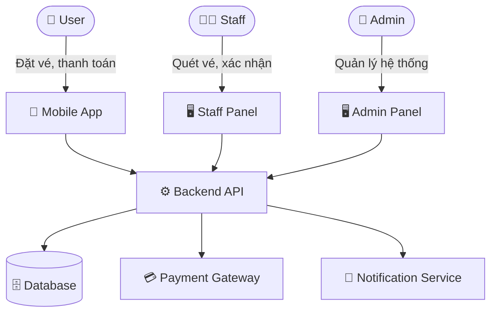
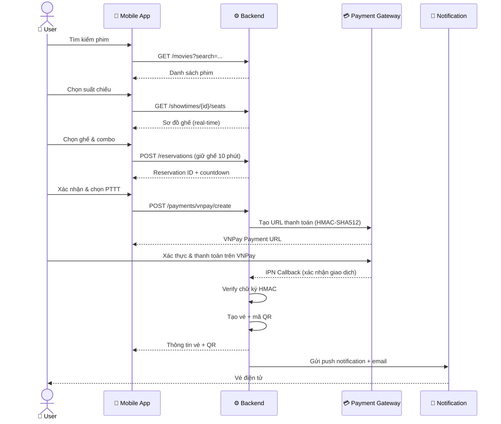
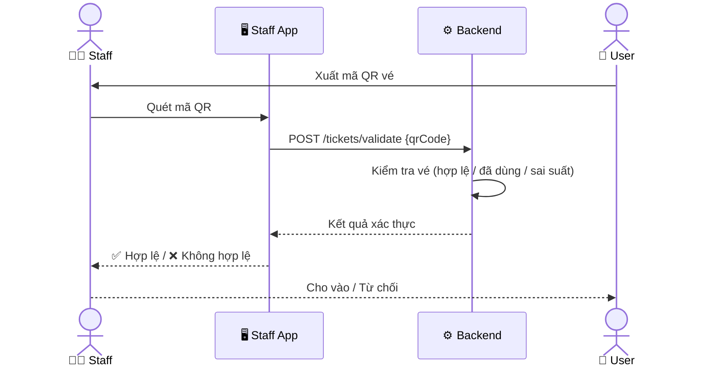
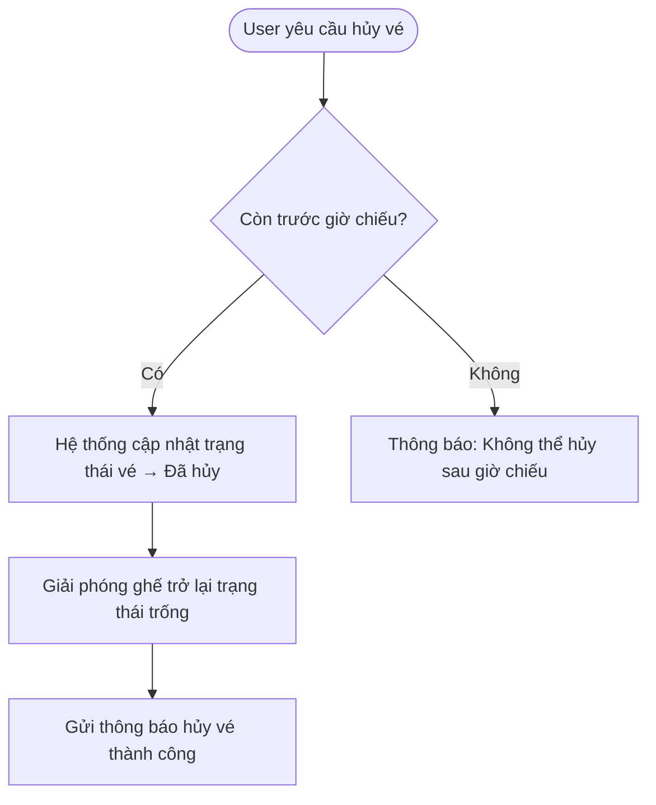

# SRS – Ứng dụng Mobile Mua Bán Vé Xem Phim

# 1. Giới thiệu

## 1.1 Mục đích tài liệu

Tài liệu này mô tả đặc tả yêu cầu phần mềm (Software Requirements Specification – SRS) cho ứng dụng mobile **mua bán vé xem phim**. Tài liệu nhằm cung cấp cái nhìn toàn diện về chức năng, phi chức năng, luồng hoạt động và các ràng buộc hệ thống để phục vụ cho quá trình thiết kế, phát triển và kiểm thử.

## 1.2 Phạm vi hệ thống

Ứng dụng hỗ trợ người dùng tìm kiếm phim, chọn suất chiếu, đặt chỗ và thanh toán vé trực tuyến. Hệ thống bao gồm:

- **App mobile** (Android & iOS) dành cho User.
- **Giao diện quản lý** (Web Admin Panel) dành cho Admin và Staff.
- **Backend API** xử lý nghiệp vụ và lưu trữ dữ liệu.

## 1.3 Định nghĩa & Viết tắt

| Thuật ngữ | Mô tả |
| --- | --- |
| SRS | Software Requirements Specification |
| User | Khách hàng sử dụng app để mua vé |
| Staff | Nhân viên rạp chiếu phim |
| Admin | Quản trị viên hệ thống |
| OTP | One-Time Password |
| QR | Quick Response Code (mã vé điện tử) |

---

# 2. Mô tả tổng quan hệ thống

## 2.1 Kiến trúc tổng quan

## 2.2 Các Actor

| Actor | Mô tả | Kênh tương tác |
| --- | --- | --- |
| **User** | Người dùng cuối, tìm phim và mua vé | Mobile App |
| **Staff** | Nhân viên rạp, xác nhận vé và hỗ trợ | Staff Panel / App |
| **Admin** | Quản trị toàn bộ hệ thống, nội dung, báo cáo | Admin Web Panel |

---

# 3. Yêu cầu chức năng

## 3.1 Actor: USER

### 3.1.1 Đăng ký / Đăng nhập

- **UC-U01** – Đăng ký tài khoản bằng email hoặc số điện thoại (xác thực OTP).
- **UC-U02** – Đăng nhập bằng email/mật khẩu hoặc OAuth (Google, Facebook).
- **UC-U03** – Quên mật khẩu, khôi phục qua email/SMS.
- **UC-U04** – Đăng xuất khỏi tài khoản.

### 3.1.2 Tìm kiếm & Xem phim

- **UC-U05** – Xem danh sách phim đang chiếu, sắp chiếu.
- **UC-U06** – Tìm kiếm phim theo tên, thể loại, diễn viên.
- **UC-U07** – Xem chi tiết phim: trailer, mô tả, thể loại, thời lượng, đánh giá.
- **UC-U08** – Xem danh sách rạp chiếu gần vị trí hiện tại (GPS).
- **UC-U09** – Lọc suất chiếu theo ngày, giờ, rạp.

### 3.1.3 Đặt vé & Chọn ghế

- **UC-U10** – Chọn suất chiếu (ngày, giờ, phòng chiếu).
- **UC-U11** – Xem sơ đồ ghế theo thời gian thực; phân biệt ghế trống / đã đặt / đang giữ.
- **UC-U12** – Chọn tối đa 8 ghế/lần đặt.
- **UC-U13** – Giữ ghế trong 10 phút khi chưa thanh toán; tự động hủy nếu hết thời gian.
- **UC-U14** – Chọn combo bắp/nước kết hợp khi đặt vé.

### 3.1.4 Thanh toán

- **UC-U15** – Thanh toán đặt vé qua **VNPay** (chuyển khoản ngân hàng, thẻ ATM nội địa, thẻ Visa/Master).
- **UC-U16** – Nhận xác nhận thanh toán thành công và vé điện tử (mã QR) qua app & email.
- **UC-U17** – Hủy vé đã đặt (trong thời gian cho phép) và nhận hoàn tiền theo chính sách.
- **UC-U18** – Xem trạng thái giao dịch VNPay (thành công / thất bại / đang xử lý).

### 3.1.5 Quản lý vé & Lịch sử

- **UC-U19** – Xem danh sách vé đã đặt (sắp chiếu, đã xem, đã hủy).
- **UC-U20** – Hiển thị mã QR vé để nhân viên quét tại cổng.
- **UC-U21** – Hủy vé (trong thời gian cho phép).
- **UC-U22** – Xem lịch sử giao dịch và tải hóa đơn.

### 3.1.6 Đánh giá & Thông báo

- **UC-U23** – Đánh giá & nhận xét phim sau khi xem.
- **UC-U24** – Nhận thông báo push: nhắc giờ chiếu, khuyến mãi, phim mới.
- **UC-U25** – Quản lý tùy chọn thông báo trong cài đặt.

### 3.1.7 Hồ sơ cá nhân

- **UC-U26** – Cập nhật thông tin cá nhân, ảnh đại diện.
- **UC-U27** – Xem lịch sử vé đã đặt.

---

## 3.2 Actor: STAFF

### 3.2.1 Xác thực vé

- **UC-S01** – Đăng nhập vào hệ thống Staff bằng tài khoản nội bộ.
- **UC-S02** – Quét mã QR vé của khách tại cổng vào rạp.
- **UC-S03** – Hiển thị kết quả xác thực: hợp lệ / đã sử dụng / sai suất chiếu.
- **UC-S04** – Tra cứu vé thủ công bằng mã vé khi không quét được QR.

### 3.2.2 Hỗ trợ khách hàng tại quầy

- **UC-S05** – Xem thông tin đặt vé của khách theo tên hoặc số điện thoại.
- **UC-S06** – Hỗ trợ đổi / hủy vé theo chính sách.
- **UC-S07** – In vé giấy hoặc gửi lại vé qua email cho khách.

### 3.2.3 Quản lý suất chiếu (Staff được phân quyền)

- **UC-S08** – Cập nhật trạng thái phòng chiếu (sẵn sàng / bảo trì).
- **UC-S09** – Báo cáo sự cố kỹ thuật phòng chiếu lên Admin.
- **UC-S10** – Xem danh sách đặt vé theo suất chiếu để chuẩn bị.

---

## 3.3 Actor: ADMIN

### 3.3.1 Quản lý nội dung

- **UC-A01** – Thêm / sửa / xóa thông tin phim (tên, poster, trailer, mô tả, thể loại, đạo diễn, diễn viên, xếp hạng tuổi).
- **UC-A02** – Quản lý danh mục thể loại phim.
- **UC-A03** – Quản lý danh sách rạp chiếu và phòng chiếu (sức chứa, loại ghế, công nghệ chiếu: 2D/3D/IMAX).
- **UC-A04** – Tạo và quản lý lịch chiếu (suất chiếu): gán phim – phòng – thời gian.

### 3.3.2 Quản lý tài khoản

- **UC-A05** – Xem, tìm kiếm danh sách tài khoản User.
- **UC-A06** – Kích hoạt / vô hiệu hóa / xóa tài khoản User.
- **UC-A07** – Tạo, phân quyền và quản lý tài khoản Staff.
- **UC-A08** – Phân quyền chi tiết theo vai trò (RBAC).

### 3.3.3 Quản lý đặt vé & Tài chính

- **UC-A09** – Xem danh sách tất cả booking, lọc theo trạng thái / ngày / rạp.
- **UC-A10** – Hủy booking và xử lý hoàn tiền qua VNPay Refund API.
- **UC-A11** – Xem thống kê số vé đã bán theo phim / suất chiếu.
- **UC-A12** – Xem báo cáo doanh thu: theo ngày / tuần / tháng / phim / rạp.
- **UC-A13** – Xuất báo cáo doanh thu dưới định dạng **Excel (.xlsx)** và **PDF**.

### 3.3.4 Cấu hình hệ thống

- **UC-A14** – Cấu hình giá vé theo loại ghế và suất chiếu.
- **UC-A15** – Quản lý banner / thông báo hiển thị trên app.
- **UC-A16** – Cấu hình thông tin tích hợp VNPay (Terminal ID, Secret Key, môi trường sandbox/production).

---

# 4. Luồng hoạt động chính (Main Flows)

## 4.1 Luồng đặt vé (Happy Path)

## 4.2 Luồng xác thực vé tại rạp

## 4.3 Luồng hủy vé

---

# 5. Yêu cầu phi chức năng

## 5.1 Hiệu năng

- Thời gian phản hồi API ≤ **500ms** cho 95% request trong điều kiện bình thường.
- Hệ thống xử lý đồng thời tối thiểu **1.000 người dùng** đặt vé cùng lúc.
- Cập nhật trạng thái ghế theo thời gian thực (WebSocket hoặc SSE) với độ trễ < **2 giây**.

## 5.2 Bảo mật

- Xác thực bằng **JWT** (access token + refresh token).
- Mã hóa mật khẩu bằng **bcrypt**.
- Mã QR vé có thời hạn hiệu lực để tránh dùng lại.
- Phân quyền theo vai trò: User / Staff / Admin.
- Giao tiếp với VNPay sử dụng **HMAC-SHA512** để xác thực chữ ký giao dịch.
- Toàn bộ API gọi đến VNPay qua **HTTPS**; không lưu thông tin thẻ trực tiếp.

## 5.3 Khả dụng & Độ tin cậy

- **SLA uptime**: ≥ 99.5%.
- Sao lưu database tự động mỗi **24 giờ**; lưu trữ tối thiểu 30 ngày.
- Hệ thống có cơ chế **failover** tự động khi một node gặp sự cố.

## 5.4 Phạm vi dự án

- Hệ thống xây dựng theo mô hình **monolithic**, phù hợp quy mô dự án.
- Hỗ trợ **1 rạp chiếu** với nhiều phòng và suất chiếu.
- Tích hợp cổng thanh toán **VNPay** (sandbox cho môi trường dev, production khi triển khai thật).

## 5.5 Khả năng sử dụng (UX)

- Luồng đặt vé hoàn thành trong **≤ 5 bước** từ màn hình chọn phim.
- Hỗ trợ **Dark Mode** và cỡ chữ có thể điều chỉnh.
- App tương thích iOS 14+ và Android 10+.
- Thời gian tải màn hình chính ≤ **3 giây** trên mạng 4G.

## 5.6 Bản địa hóa

- Hỗ trợ ngôn ngữ: **Tiếng Việt** (mặc định), Tiếng Anh.
- Đơn vị tiền tệ: **VNĐ**.

---

# 6. Mô hình dữ liệu (Entity Overview)

| Entity | Thuộc tính chính |
| --- | --- |
| **User** | id, fullName, email, phone, passwordHash, avatar, memberRank, points, createdAt |
| **Movie** | id, title, description, genre[], duration, director, cast[], poster, trailer, rating, releaseDate, status |
| **Cinema** | id, name, address, city, latitude, longitude, phone |
| **Room** | id, cinemaId, name, capacity, screenType (2D/3D/IMAX), status |
| **Seat** | id, roomId, row, column, type (Standard/VIP/Couple), price |
| **Showtime** | id, movieId, roomId, startTime, endTime, price, status |
| **Booking** | id, userId, showtimeId, seats[], totalAmount, status, createdAt |
| **Ticket** | id, bookingId, seatId, qrCode, isUsed, usedAt |
| **Payment** | id, bookingId, method ("vnpay"), amount, status, vnpayTransactionId, vnpayResponseCode, paidAt |
| **Review** | id, userId, movieId, rating, comment, createdAt |
| **Staff** | id, fullName, email, cinemaId, role, status |

---

# 7. Ràng buộc & Giả định

- Mỗi User chỉ được đặt tối đa **8 ghế** cho một suất chiếu.
- Ghế được **giữ 10 phút** sau khi chọn; nếu chưa thanh toán sẽ tự động hủy.
- Chính sách hủy vé: hoàn **100%** nếu hủy trước 2 tiếng; hoàn **50%** nếu hủy trong vòng 2 tiếng trước giờ chiếu; **không hoàn** sau giờ chiếu.
- Hoàn tiền thực hiện qua **VNPay Refund API**; thời gian phản ánh vào tài khoản theo ngân hàng (1–3 ngày làm việc).
- Mã QR vé có hiệu lực từ **2 giờ trước suất chiếu** đến **30 phút sau giờ chiếu**.
- Hệ thống tích hợp VNPay theo tài liệu **VNPay Payment Gateway v2.1.0**.

---

# 8. Phụ lục – Danh sách Use Case tổng hợp

| Mã UC | Tên Use Case | Actor | Độ ưu tiên |
| --- | --- | --- | --- |
| UC-U01~U04 | Xác thực tài khoản | User | Cao |
| UC-U05~U09 | Tìm kiếm phim & suất chiếu | User | Cao |
| UC-U10~U14 | Chọn ghế & giữ chỗ | User | Cao |
| UC-U15~U18 | Thanh toán VNPay & hủy vé | User | Cao |
| UC-U19~U22 | Quản lý vé | User | Cao |
| UC-U23~U25 | Đánh giá & Thông báo | User | Trung bình |
| UC-U26~U27 | Hồ sơ cá nhân | User | Trung bình |
| UC-S01~S04 | Xác thực vé tại cổng | Staff | Cao |
| UC-S05~S07 | Hỗ trợ khách tại quầy | Staff | Cao |
| UC-S08~S10 | Quản lý phòng chiếu | Staff | Trung bình |
| UC-A01~A04 | Quản lý nội dung | Admin | Cao |
| UC-A05~A08 | Quản lý tài khoản | Admin | Cao |
| UC-A09~A13 | Quản lý đặt vé, doanh thu & xuất báo cáo | Admin | Cao |
| UC-A14~A16 | Cấu hình hệ thống & VNPay | Admin | Trung bình |
